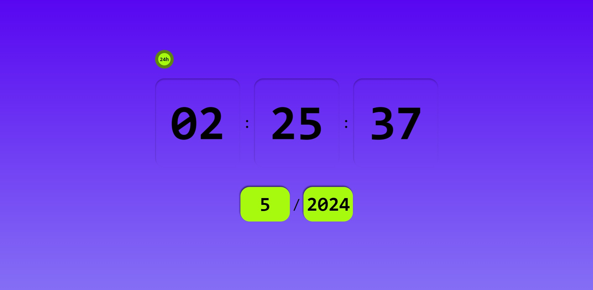
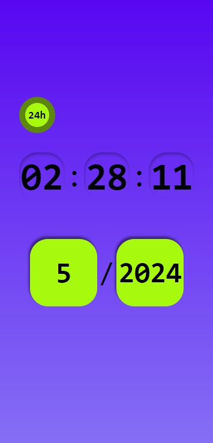

# Digital Clock

This is a Digital Clock project using React, Styled Components, and JavaScript.

## Table of Contents

- [Description](#description)
- [Screenshot](#screenshot)
- [Links](#links)
- [Technologies Used](#technologies-used)
- [Author](#author)

### Description

Users can view a digital clock displaying the current time in either 24-hour format or AM/PM, utilizing React with hooks like useState and useEffect, Styled Components, and JavaScript.

### Screenshot

### Links

- [See live project](#) ((https://digital-watch-project.netlify.app/))

### Technologies Used

- React
- Styled Components
- JavaScript

### Author

- LinkedIn - [Vinicius Campiotto](#) ([https://www.linkedin.com/in/vinicius-campiotto-421233250/])
